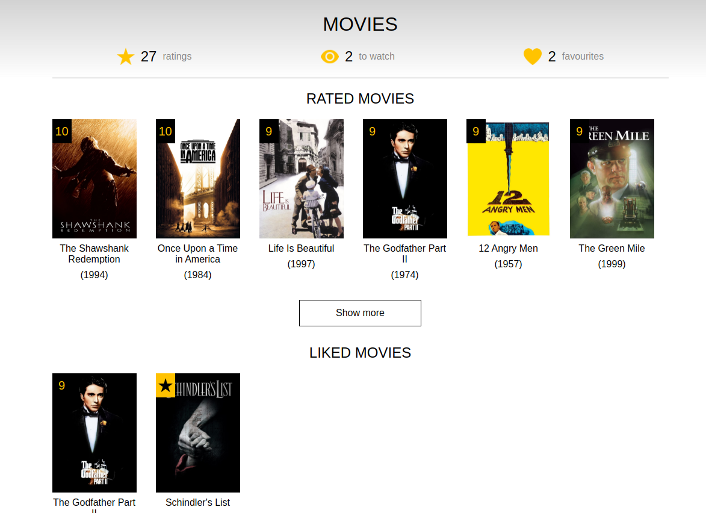

# Filmbase Project

Project available on: https://benodkk.github.io/Project-Filmbase/

## Run project locally

To run project locally: npm start

## Database

All information for every movie and TV series is fetched from the following source: https://developers.themoviedb.org/

## Project description

The project is based on the Polish website filmweb and includes some of the features found on the site. Users can browse movies and TV shows. Each movie and TV show has its own page with a description. Users can like, rate, or add movies and TV shows to their "to watch" list. On the user's dedicated page, all the movies and TV shows that the user has liked, rated or added to their "to watch" list will be displayed.

### Searching bar

The website also includes a search bar where users can search for movies and TV shows by typing in keywords.

### Movies/Tv Series list

The list is a paginated page, which contains all movies and TV shows. The list can be filtered and sorted according to available options.

### Add Movie/Tv Series to your list

Users can hover over a gold square with a black star in the top left corner of the movie poster. Upon hovering, a card will appear where the user can rate, favorite, or add the movie or TV show to their "to watch" list.

### User profile

The user page showcases a curated selection of movies and series that have been favored, rated, or added to the "to watch" list by the user. In cases where the lists contain more than six items and not all of them can be displayed on the page, a convenient button will appear, allowing the user to navigate to a dedicated page that displays all the items in the list

### Details page

Each movie/series has its own dedicated page where detailed information about the movie/series can be viewed.

